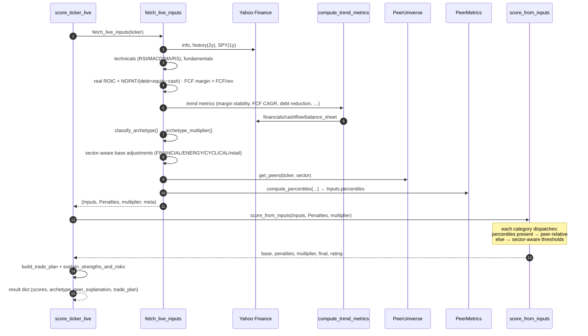
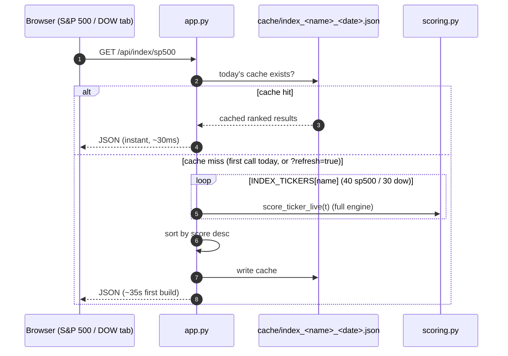
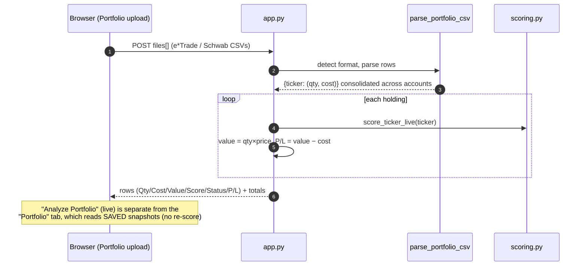

# artikBroker — Architecture

How artikBroker is wired and what it calls. **No LLM** — the scoring is a deterministic Python
engine over live Yahoo Finance data, with daily-cached peer and index data.

- **Frontend:** `static/index.html` (vanilla JS SPA, 4 tabs)
- **Backend:** `app.py` (FastAPI, port **8100**) on the `artikAPIs` venv
- **Engine (reused):** the **`artik-engine`** package at `artikAgents/agents/stock_broker_agent/artik_engine/` (`scoring.py` + `peer_universe.py` + `peer_metrics.py`), installed editable & imported as `from artik_engine import scoring`
- **Only external service:** Yahoo Finance (via `yfinance`) — no API key

---

## 1. Component / flow diagram

```mermaid
flowchart TD
    subgraph Browser["🌐 Browser — static/index.html (vanilla JS)"]
        TA["Analyze tab"]:::ui
        TP["Portfolio tab"]:::ui
        TS["S&P 500 tab"]:::ui
        TD["DOW tab"]:::ui
        EX["Explain (per row)"]:::ui
        DL["Download CSV"]:::ui
    end

    subgraph API["⚙️ app.py — FastAPI :8100"]
        R0["GET /  → index.html"]:::api
        R1["GET /api/analyze?symbols="]:::api
        R2["POST /api/analyze_portfolio (CSV upload)"]:::api
        R3["GET /api/portfolio/dates"]:::api
        R4["GET /api/portfolio?date="]:::api
        R5["GET /api/index/{sp500|dow}"]:::api
        AO["analyze_one(ticker)"]:::api
        PP["parse_portfolio_csv()"]:::api
    end

    subgraph Engine["🧮 artik_engine package (scoring.py) — deterministic, no LLM"]
        STL["score_ticker_live(ticker)"]:::eng
        FLI["fetch_live_inputs()"]:::eng
        TM["compute_trend_metrics()"]:::eng
        CLS["classify_archetype()<br/>archetype_multiplier()"]:::eng
        CAT["value/quality/growth/fin scorers<br/>(percentile ↔ threshold dispatch)"]:::eng
        SFI["score_from_inputs() → base × multiplier"]:::eng
    end

    subgraph Peers["📊 Peer layer"]
        PU["peer_universe.py<br/>PeerUniverseService"]:::peer
        PM["peer_metrics.py<br/>PeerMetricsService + percentiles"]:::peer
    end

    subgraph Data["💾 Data / caches"]
        CSV["data/sp500_constituents.csv"]:::data
        PMC["data/peer_metrics_&lt;date&gt;.json<br/>(daily, per sector)"]:::data
        IDX["artikBroker/cache/index_&lt;name&gt;_&lt;date&gt;.json<br/>(daily)"]:::data
        PORT["Stock_Portfolio/&lt;date&gt;/combined_portfolio_*.csv"]:::data
    end

    subgraph Ext["☁️ External services (HTTP)"]
        YF["Yahoo Finance (yfinance)<br/>Ticker.info · history(2y) · SPY · financials/cashflow/balance_sheet"]:::ext
        WIKI["Wikipedia: List_of_S&amp;P_500_companies<br/>(only when building the CSV)"]:::ext
        GH["GitHub datasets/s-and-p-500-companies<br/>(CSV fallback)"]:::ext
    end

    TA --> R1
    TP --> R3 --> R4
    TS --> R5
    TD --> R5
    EX --> R1
    DL -. client-side .-> TA

    R1 --> AO
    R2 --> PP --> AO
    R5 -->|cache miss| AO
    R5 -->|cache hit| IDX
    R4 --> PORT
    R3 --> PORT

    AO --> STL --> FLI
    AO -->|price fallback| YF
    FLI --> TM --> YF
    FLI --> CLS
    FLI --> CAT
    FLI --> PU
    PU -->|read| CSV
    PU -. build if missing .-> WIKI
    PU -. fallback .-> GH
    FLI --> PM
    PM -->|read/write| PMC
    PM --> YF
    FLI --> YF
    STL --> SFI
    SFI --> CAT

    classDef ui fill:#1e3a8a,stroke:#60a5fa,color:#fff
    classDef api fill:#065f46,stroke:#10b981,color:#fff
    classDef eng fill:#7e22ce,stroke:#a855f7,color:#fff
    classDef peer fill:#854d0e,stroke:#eab308,color:#fff
    classDef data fill:#334155,stroke:#94a3b8,color:#fff
    classDef ext fill:#000,stroke:#22c55e,color:#22c55e,stroke-width:2px
```



---

## 1b. Complete call inventory — everything artikBroker touches

### Internal modules (in-process imports)
| From | Imports / calls | Purpose |
|---|---|---|
| `app.py` | `from artik_engine import scoring` (installed package) | the scoring engine |
| `app.py` | `yfinance` (direct) | price fallback in `analyze_one` / `_live_price` |
| `artik_engine.scoring` | `peer_universe`, `peer_metrics` (relative), `numpy`, `pandas`, `yfinance` | engine + peer layer |
| `peer_universe.py` | `requests`, `pandas.read_html` (build only) | fetch S&P 500 list |
| `peer_metrics.py` | `yfinance` | per-peer metrics |

### Python packages (resolved from the **artikAPIs venv**)
`fastapi`, `uvicorn` (server) · `yfinance` (market data) · `pandas`, `numpy` (compute) ·
`requests` + `lxml` (S&P 500 CSV build via `read_html`) · `python-multipart` (CSV upload on `/api/analyze_portfolio`).
Frontend: **none** — `static/index.html` is pure vanilla JS (no CDN, no framework, no build step).

### Files read / written
| Path | R/W | By |
|---|---|---|
| `artikBroker/static/index.html` | read (served) | `GET /` + StaticFiles |
| `artikBroker/cache/index_<name>_<date>.json` | read+write | `/api/index/{name}` (daily) |
| `…/stock_broker_agent/artik_engine/data/sp500_constituents.csv` | read (build if missing) | `peer_universe` |
| `…/stock_broker_agent/artik_engine/data/peer_metrics_<date>.json` | read+write | `peer_metrics` (daily, per sector) |
| `…/knowledge_bases/Stock_Portfolio/<date>/combined_portfolio_*.csv` | read | `/api/portfolio*` |
| uploaded broker CSVs (e*Trade/Schwab) | read (in-memory) | `/api/analyze_portfolio` |

### External HTTP
| Service | When | Frequency |
|---|---|---|
| **Yahoo Finance** (`yfinance`) | every score: `.info`, `.history(2y)`, SPY, `.financials`/`.cashflow`/`.balance_sheet`; peers `.info` | per ticker + per-sector cohort (cached daily) |
| **Wikipedia** S&P 500 list | only if `sp500_constituents.csv` is missing | once (then cached file) |
| **GitHub** constituents CSV | only if Wikipedia fetch fails | fallback |

### What artikBroker does **NOT** call (deliberately)
- ❌ **No LLM** — no `anthropic`, no `openai`, no `model_config` (deterministic engine only).
- ❌ **Not the artikAPIs service** (`:8000`) — fully standalone on `:8100`; shares only the `scoring.py` *code* and the same venv.
- ❌ **No database, no auth, no network egress** beyond Yahoo Finance (+ the one-time Wikipedia/GitHub list build).

### Sibling utility (not part of the running server)
`artikBroker/rerun_portfolio.py` — one-off script: imports `scoring`, re-scores the saved portfolio, rewrites `combined_portfolio_<date>.csv`.

---

## 2. Endpoint → data map

| Endpoint | Purpose | Calls | Cache |
|---|---|---|---|
| `GET /` | serve SPA | `static/index.html` | — |
| `GET /api/analyze?symbols=` | score N symbols live | `analyze_one` → `score_ticker_live` | none (live) |
| `POST /api/analyze_portfolio` | parse broker CSVs → score holdings | `parse_portfolio_csv` → `analyze_one` | none |
| `GET /api/portfolio/dates` | list saved snapshots | scans `Stock_Portfolio/*/combined_portfolio_*.csv` | file-backed |
| `GET /api/portfolio?date=` | read a saved snapshot (no re-score) | reads `combined_portfolio_<date>.csv` | file-backed |
| `GET /api/index/{sp500\|dow}` | score curated index live | `analyze_one` over `INDEX_TICKERS` | `cache/index_<name>_<date>.json` (daily) |

---

## 3. Sequence — symbol analysis (`GET /api/analyze`) + Explain

```mermaid
sequenceDiagram
    autonumber
    participant U as Browser
    participant API as app.py (FastAPI)
    participant S as scoring.py
    participant PU as PeerUniverse
    participant PM as PeerMetrics
    participant YF as Yahoo Finance

    U->>API: GET /api/analyze?symbols=NVDA,JPM
    loop each symbol
        API->>S: score_ticker_live(t)
        S->>YF: info + 2y history + SPY
        S->>YF: financials / cashflow / balance_sheet (trend metrics)
        S->>S: real ROIC, FCF margin, classify_archetype, multiplier
        S->>PU: get_peers(t, sector)
        PU-->>S: sector peer tickers (from sp500_constituents.csv)
        S->>PM: compute_percentiles(sector, peers, company_metrics)
        alt sector cache cold (first today)
            PM->>YF: fetch ~60 peers' info (once)
            PM->>PM: write peer_metrics_<date>.json
        else cache warm
            PM-->>S: cached distribution
        end
        S->>S: category scores (percentile→points) − penalties × multiplier = final
        S-->>API: {score, rating, archetype, breakdown, peer_explanation, …}
    end
    API-->>U: ranked JSON (one row per symbol)
    Note over U: "Explain" button re-uses the same row's breakdown<br/>(expands client-side; no second call)
```

---

## 4. Sequence — internal scoring (`score_ticker_live`)



---

## 5. Sequence — index tab with daily cache (`GET /api/index/{name}`)



---

## 6. Sequence — portfolio upload (`POST /api/analyze_portfolio`)



---

## 7. Notes

- **Deterministic, no LLM:** every score traces to rules + live data; identical inputs → identical output.
- **Two cache layers (daily):** peer-metric distributions per sector (`peer_metrics_<date>.json`) and
  index results (`index_<name>_<date>.json`). First touch builds; rest of the day is instant.
- **Graceful degradation:** if peer data is unavailable, category scoring falls back to sector-aware
  thresholds; if a ticker/statement fetch fails, that row returns an error but the run never crashes.
- **Shared engine:** `scoring.py` is the same engine used by `RUN_STOCK_ANALYSIS.md`, `sp500_screen.py`,
  and the stock_broker_agent pipeline — artikBroker is a thin FastAPI + SPA over it.
- **Run:** `cd artikBroker && ./run.sh` → http://localhost:8100
