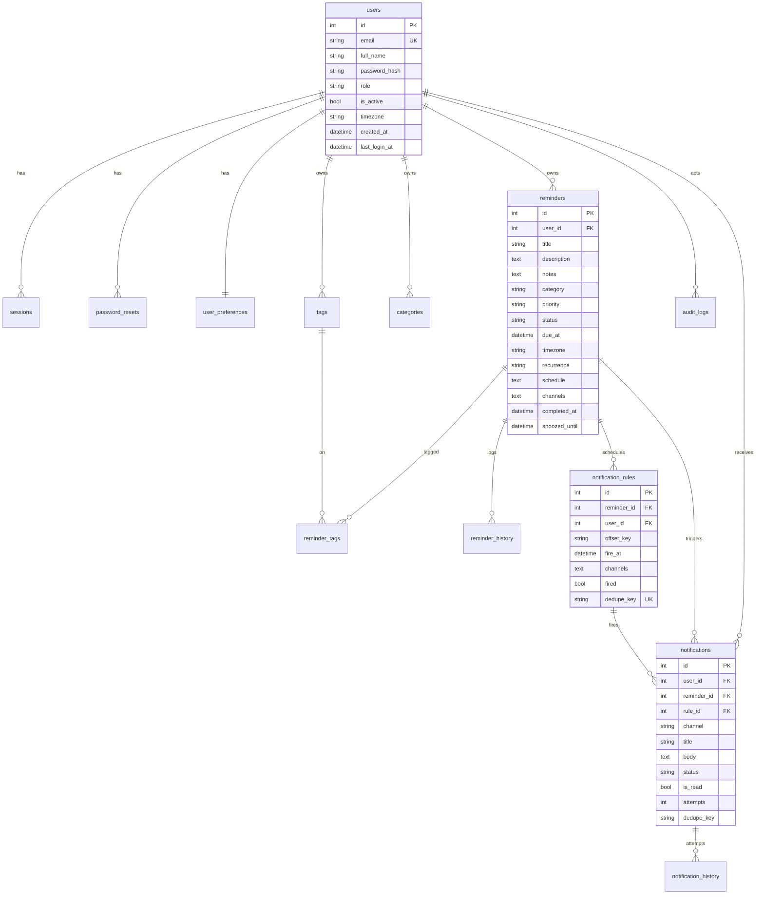

# Entity-Relationship Diagram

14 tables. SQLite locally; identical schema on Postgres/RDS.

**Tables:** `users`, `sessions`, `password_resets`, `user_preferences`, `reminders`,
`categories`, `tags`, `reminder_tags`, `reminder_history`, `notification_rules`,
`notifications`, `notification_history`, `email_templates`, `scheduler_jobs`,
`audit_logs`.

Key design points:
- `reminders.schedule` / `reminders.channels` are JSON arrays (text) — portable.
- `notification_rules.dedupe_key` is **unique** → a schedule offset fires once.
- `notifications.dedupe_key` (`<rule>:<channel>`) prevents duplicate deliveries.
- Statuses: reminder = active/completed/archived/snoozed/deleted; notification =
  pending/sent/failed/read/archived/deleted.
